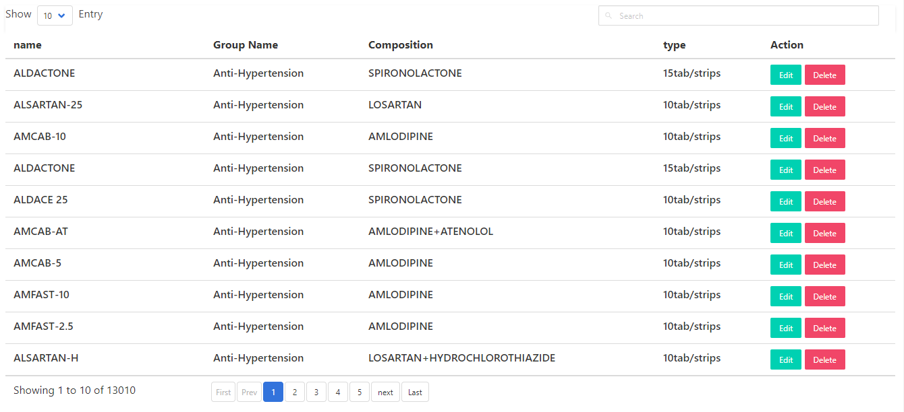

# vue-serveside-datatable

You can use this component by simply copy `datatable.vue` and add inside to your components folder in your project.

You should use specific `GET` params in endpoint.

```
http://localhost:3000/api/enquiry?limit=10&page=1&sortBy=name&order=asc&searchText=ashi
```

| params     | Description                  |
| ---------- | ---------------------------- |
| limit      | no of data to show in a page |
| page       | Current page Number          |
| sortBy     | database field name to sort  |
| order      | asc or desc                  |
| searchText | any search Text              |

For using this components you need api endpoint like mentioned above and response should exactly look like this.

```json
{
  "currentPage": 1,
  "nextPage": 2,
  "totalNumberOfPage": 651,
  "currentPageData": 20,
  "totalData": 13010,
  "data": [
    {
      "name": "Ashish",
      "address": "Kathmandu",
      "email": "hello@gmail.com"
    },
    {
      "name": "Atul",
      "address": "kathmandu",
      "email": "helloa21@gmail.com"
    },
    {
      "name": "Kritish",
      "address": "kathmandu",
      "email": "hellokritish@gmail.com"
    }
  ]
}
```

In endpoint you can pass `GET` params with parameters props. But this params is optional and can be passed null as default. Every thing is handled inside components.

> ### Props to Define

```html
<datatable
  :endpoint="tableData.endpoint"
  :columns="tableData.columns"
  :parameters="tableData.params"
  :refresh="tableData.refresh"
>
  <template slot-scope="item">
    <a class="button is-primary is-small" @click="edit(item)">Edit</a>
    <a class="button is-danger is-small" @click="del(item)">Delete</a>
  </template>
</datatable>
```

> Props
> | props | Description | |
> |------------|-----------------------------------------------------------------------------------------------------------------------------------------------|---|
> | endpoint | This is endpoint for you api. Response Should look like above mentioned | |
> | columns | columns to show in table. It should be passed as array of object. object contains field , column as compulsory key and render as optional key | |
> | parameters | This is parameters to pass and this is done automatically in emit event. You just have to pass it in props as null | |
> | refresh | This is true and false toggle props to refresh datatable for reactivity | |

### the above defined props is defined in data

```js
tableData: {
      params: null,
      //can be define this as null(recommended)
      refresh: true, //always define as either true or false
      endpoint: "http://localhost:3000/your-endpoint",
      columns: [
        {
          field: "name",
          /* field from api response. this should be same as in
          api response*/
          column: "name", //String to Display in datatable columns
          render: function(field) {
            //for rendering as per condition in datatable.
            //Just like jquery render. This is optional
            return !field ? "ok" : field;
          }
        },
        {
          field: "address",
          column: "address",
          render: function(field) {
            return !field ? "..." : field;
          }
        },
        {
          field: "email",
          column: "Email",
          render: function(field) {
            return !field ? "<p class='has-text-primary'>No Email</p>" : field;
          }
        }
      ],
  }
```

#### After you have delete and edit buttons or your prefered actions buttons you can send axios request as mentioned below

```js
  methods: {
    edit: function(event) {
      // console to see what event object contains.
      alert("edit event");
    }
  }
```

## Full code Implementation

```html
<template>
  <div>
    <datatable
      :endpoint="tableData.endpoint"
      :columns="tableData.columns"
      :parameters="tableData.params"
      :refresh="tableData.refresh"
    >
      <template slot-scope="item">
        <a class="button is-primary is-small" @click="edit(item)">Edit</a>
        <a class="button is-danger is-small" @click="del(item)">Delete</a>
      </template>
    </datatable>
  </div>
</template>
```

```js
import datatable from "../components/datatable";
export default {
  components: {
    datatable,
  },
  data: () => ({
    tableData: {
      params: null,
      refresh: true,
      endpoint: "https://app.medmandu.life/api/your-endpoint",
      //no get params needed to pass here
      columns: [
        {
          field: "name",
          column: "name",
          render: function (field) {
            return !field ? "ok" : field;
          },
        },
        {
          field: "group_name",
          column: "Group Name",
          render: function (field) {
            return !field ? "..." : field;
          },
        },
        {
          field: "composition",
          column: "Composition",
          render: function (field) {
            return !field ? "..." : field;
          },
        },
        {
          field: "type",
          column: "type",
          render: function (field) {
            return !field ? "<p class='has-text-primary'>..</p>" : field;
          },
        },
      ],
    },
  }),
  methods: {
    edit: function (event) {
      alert(`edit action here`);
      this.tableData.refresh = !this.tableData.refresh;
    },
    del: function (event) {
      alert(`delete action here`);
      this.tableData.refresh = !this.tableData.refresh;
    },
  },
};
```

# preview


